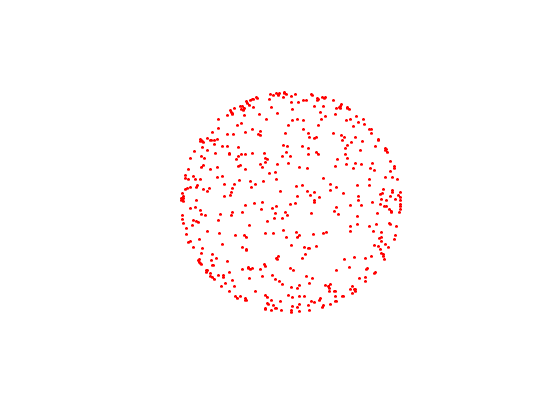
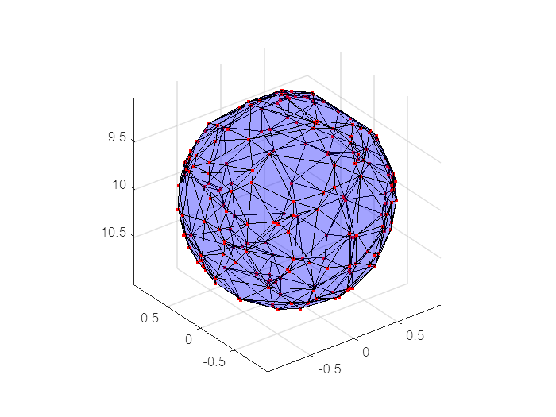
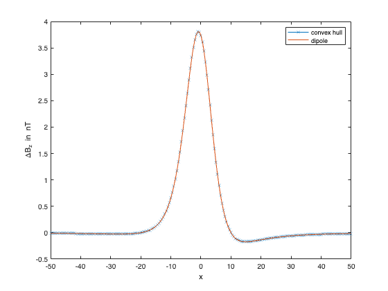
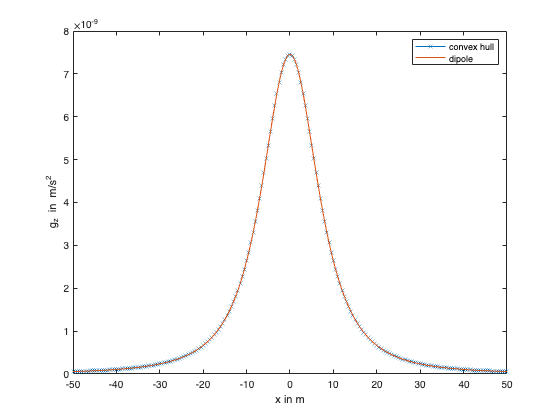

```matlab:Code
clearvars
close('all')
```

# Calculation of gravity and magnetic fields of a spherical body
# Introduction

This notebook serves as an example on how to use the `GravMag3D` MATLAB toolbox to model gravity and magnetic responses due to solid bodies with homogeneous density $\rho$ or magnetization $M$.

The shape of the bodies under consideration can be constructed using a triangulation of a point cloud sampled at their surface.

Given such a surface triangulation, the gravity and magnetic anomaly can be calculated using surface integrals across the individual triangles. The sum of all triangle contributions finally yields the gravity or magnetic anomaly.

# Usage tutorial

We consider an approximation to the shape of a spherical body using a triangulation of sufficiently many points at the surface of a sphere.

The center of the sphere is at the point $(0,0,10)$. Its radius is $1$.

To this end, we create n points by randomly choosing angles $\varphi$  and $\theta$.

```matlab:Code
rng(0,'twister');
n = 200;
phi = 2 * pi * rand(n, 1);
theta = asin(2 * rand(n, 1) - 1);
radius = 1.0;
[vtx(:, 1), vtx(:, 2), vtx(:,3)] = ...
    sph2cart(phi, theta, radius);
depth = 10.0;
vtx(:, 3) = vtx(:, 3) + depth;
```

```matlab:Code
scatter3(vtx(:, 1), vtx(:, 2), vtx(:, 3), 8, 'filled', ...
    'MarkerFaceColor', 'red');
set(gca, 'ZDir', 'reverse');
axis equal
```



From a *Delaunay* triangulation we obtain the *convex hull* formed by the vertices.

```matlab:Code
[ch, v] = convexHull(delaunayTriangulation(vtx));
```

The array `ch` contains the vertices of the convex hull of the triangulation. The volume of the convex hull is returned in the array `v`.

```matlab:Code
trisurf(ch, vtx(:,1), vtx(:,2), vtx(:,3), ...
    'FaceColor', 'blue', 'FaceAlpha', 0.2);
hold on
scatter3(vtx(:, 1), vtx(:, 2), vtx(:, 3), 8, 'filled', ...
    'MarkerFaceColor', 'red');
set(gca, 'ZDir', 'reverse');
hold off
axis equal
```



We also need the direction of the outer normals of the triangles. The normal direction can be calculated using a vector cross product.

```matlab:Code
nf = size(ch, 1);
Un = zeros(nf, 3);
for i = 1:nf
    v1 = vtx(ch(i, 2), :) - vtx(ch(i, 1), :);
    v2 = vtx(ch(i, 3), :) - vtx(ch(i, 1), :);
    v1_cross_v2 = cross(v1, v2);
    Un(i, :) = v1_cross_v2 ./ norm(v1_cross_v2);
end
```

We now want to compute the gravitational attraction and the magnetic total field anomaly of the sphere along a profile $-50\le x\le 50$.

```matlab:Code
nx = 101;
x = linspace(-50, 50, nx);
```

For the calculation of the magnetic anomaly we need the ambient field. It is defined by the vector field $T$ which represents the magnetic flux density of the Earth's magnetic field. The ambient field is considered homogeneous in the region of the measurements. Typically, it is given in units of nanoTesla (nT). A typical value of $T$ in Middle Europe is

$T=(15000,0,45000)^{\top }$ nT.

The magnetic reponse of a magnetized body is proportional to both the ambient field $T$ as well as its susceptibility $\kappa$. Both can be combined to the magnetization $M$, such that

$M=\frac{\kappa }{\mu_0 }T$.

For our experiment, we set $\kappa =0.126$ given in dimensionless SI units.

```matlab:Code
T = [15000; 0; 45000];
mu0 = pi * 4e-7;
kappa = 0.126;
M = kappa / mu0 * T;
```

For gravity we need the mass density of the sphere. We choose $\rho =2700~kg/m^3$.

```matlab:Code
rho = 2700;
```

In the following we compute the magnetic anomaly $\Delta B$ and the vertical component of the gravitational attraction $g_z$ of our sphere.

We also compare to reference solutions.

The anomaly of a magnetized sphere is equivalent to a magnetic dipole with dipole moment $m=\int MdV$.

Further, the gravitational attraction of a sphere is equal to that of a point mass with mass $m=\int \rho dV$.

```matlab:Code
Bx = zeros(nx, 1);
By = zeros(nx, 1);
Bz = zeros(nx, 1);
B = zeros(3, nx);
gz = zeros(nx, 1);
g = zeros(nx, 1);
for i = 1:nx
    xyz = [x(i), 0, 0];
    r = [0, 0, depth] - xyz;
    [Bx(i), By(i), Bz(i), ~, ~, gz(i)] = ...
        get_H(ch, vtx - xyz, Un, M, rho);
    B(:, i) = mu0 * (3 * dot(r(:), M * v) * r(:) - M * v * norm(r)^2) / (4 * pi * norm(r)^5);
    g(i) = 6.6732e-11 * rho * v * depth ./ sqrt(x(i)^2 + depth^2).^3;
end
```

```matlab:Code
plot(x, Bz, '-x', x, B(3, :))
legend('convex hull', 'dipole', 'Location', 'northeast')
xlabel('x')
ylabel('\DeltaB_z in nT')
```



```matlab:Code
plot(x, gz, '-x', x, g)
legend('convex hull', 'dipole')
xlabel('x in m')
ylabel('g_z in m/s^2')
```


